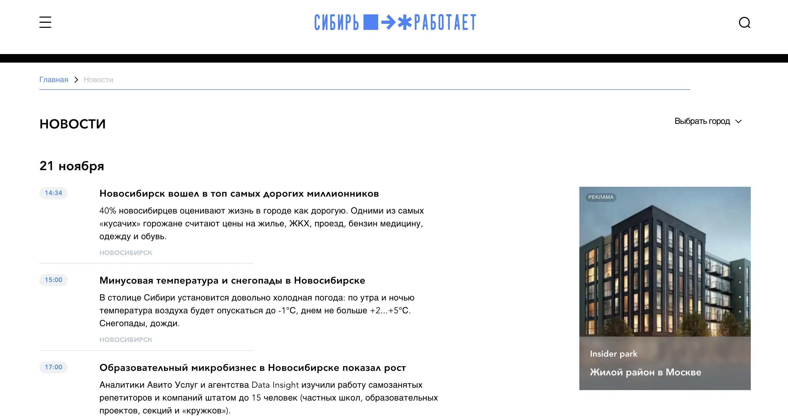

# Проект Siberia work (тестовое задание)

[Ссылка на проект на Versel](https://siberia-work.vercel.app/)

## Описание задания

Подготовить вёрстку страницы Новостей по [макету в Figma](https://www.figma.com/file/YEUCzto7uPK8ga0ytCQuFP/C%D0%B8%D0%B1%D0%B8%D1%80%D1%8C-%D1%80%D0%B0%D0%B1%D0%BE%D1%82%D0%B0%D0%B5%D1%82-v.2?node-id=0%3A1&t=q9J7XJDPKXf7H02z-0
).

### Технические требования:

✔ использовать Nuxt;  
✔ использовать Vuex.

### Стек:

* JS
* Nuxt
* Vue, Vuex
* HTML
* CSS

## Директории

`/assets` — статичные данные и файлы  
`/components` — компоненты  
`/layouts` — страницы приложения   
`/pages` - роуты  
`/static` - статичный файл для деплоя   
`/store` - глобальное хранилище данных

## Установка зависимостей и запуск проекта

##### `npm i` – установить зависимости

##### `npm dev` – запуск devServer на localhost

##### `npm build` `npm start` – production сборка проекта
